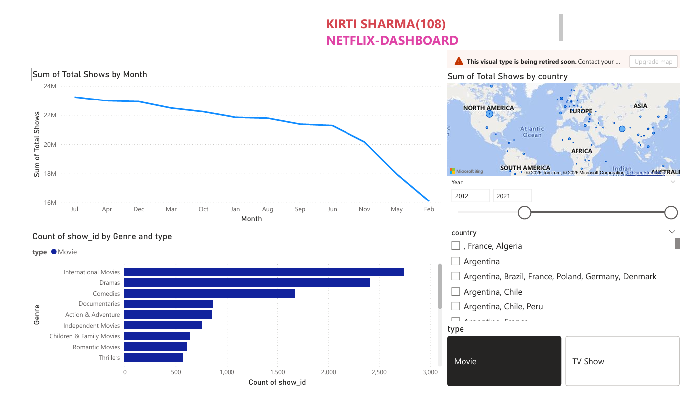

# Netflix_Dashboard_Analysis

## Project Overview
This project presents an interactive Netflix Dashboard created using Power BI to analyze movies and TV shows available on Netflix. The dashboard provides insights into content trends, genre distribution, release patterns, and country-wise availability.

## Tools & Technologies
- Power BI
- Python
- SQL
- Data Visualization
- Data Cleaning

## Features of Dashboard
- Monthly trend analysis of total shows
- Genre-wise content distribution
- Country-wise Netflix content visualization
- Movie vs TV Show comparison
- Interactive filters and slicers
- Year-based analysis

## Dashboard Insights
- International Movies and Dramas are the most common content categories.
- Movies dominate the platform compared to TV Shows.
- Content availability varies significantly across countries.
- Netflix content additions fluctuate throughout the year.

## Visualizations Included
- Line Chart for monthly content trends
- Bar Chart for genre analysis
- Map Visualization for country-wise distribution
- Interactive filters for:
  - Year
  - Country
  - Type (Movie / TV Show)

## Dataset Information
The dataset contains:
- Show ID
- Genre
- Country
- Release Year
- Type
- Total Shows

## Dashboard Preview

## Learning Outcomes
Through this project, I learned:
- Data visualization using Power BI
- Dashboard design and reporting
- Trend and genre analysis
- Interactive filtering techniques
- Business insight generation from datasets

## Conclusion
This dashboard helps understand Netflix content trends and distribution using interactive visual analytics. It simplifies large datasets into meaningful insights for better decision-making and analysis.

## Author
Kirti Sharma
